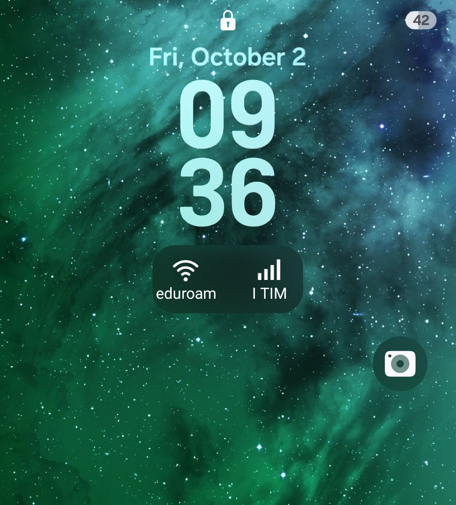

### Some human words first:

I got the new z flip 8 and was hugely disappointed with the cover screen options - there was no way to see if I am connected to anything with a quick glance without unlocking the device and swapping for the information. Home screen also hides networks names in newer androids now, which was annoying. Google led me to a few community projects, but nothing worked exactly the way I wanted. So I figured I could write something for myself, or, rather, have claude write it for me. After a few iterations I got what I wanted  - nice little widget that can go right to the locked cover screen (but also to home screen) and show me everything I need. It still has 1 minute lag for network updates, doesn't reflect the signal strength, but that's good enough for me. I decided to share this in case someone faces the same problem, but doesn't have claude and/or the skills. Publishing on playstore is too much trouble, so for now let it just be here for the brave souls who install unknown github projects on their phones. The rest of the readme is written by claude .

## CoverNet

Wi-Fi + cellular connectivity on the **locked cover screen** of a Samsung Galaxy Z Flip — plus the same
widget for the home screen, and a Wi-Fi access-point scanner. No root, no Good Lock.





The Flip's over screen shows the battery but no network status. Samsung lets third-party widgets onto the
cover *widget pages*, but those are only reachable after unlocking. The tiles on the clock face itself —
the ones that show while the phone is locked — were, until now, Samsung-only. CoverNet gets a widget in
there; see [How it works](#how-it-works).

Tested on a Galaxy Z Flip 8 (SM-F776B), One UI 9 / Android 17. It should work on Flip 7 (One UI 8) too —
please report.

## For users

### Install

1. Download the latest `CoverNet-x.y.apk` from [Releases](../../releases).
2. Open it on the phone and allow installing from that app (browser / Files). You will see a Play Protect
   warning because the app isn't on the store — that's expected for a sideloaded app.
3. Open CoverNet once and go through the numbered buttons:
   - **1. Allow location** and **2. Allow location "all the time"** — only needed if you want the Wi-Fi
     *name* shown. Android treats the SSID as location data, and the widget refreshes in the background.
     Without these the label just says "Wi-Fi".
   - **3. Battery → Unrestricted** — otherwise Android throttles the app's timers to a few per hour and the
     widget goes stale (One UI also puts unused apps to sleep after a few days).
   - **4. Allow exact alarms** — makes the refresh land on the minute instead of whenever Android feels like it.

### Add the widgets

- **Cover screen (locked):** Settings → Cover screen → tap the clock style → **+ widgets** → CoverNet.
  Works in the 1×1 and 2×1 slots.
- **Home screen:** long-press the home screen → Widgets → CoverNet (2×1, resizable).

### What it shows

| Icon | Label | Meaning |
|---|---|---|
| Wi-Fi arcs | SSID (or "Wi-Fi") | connected with internet |
| Wi-Fi arcs | "no internet" | associated, but no internet behind it (captive portal, dead uplink) |
| Wi-Fi arcs, slashed | "off" | Wi-Fi off or not connected |
| Signal bars | operator name | registered on a mobile network (even while Wi-Fi carries the data) |
| Signal bars, slashed | "no service" / "no SIM" | — |

Tapping a widget refreshes it immediately; otherwise it refreshes once a minute while the phone is awake.
While the phone sleeps nothing runs; the pending refresh is delivered when the screen wakes, so the tile is
at most a minute stale.

### Wi-Fi access points

CoverNet → **Wi-Fi access points nearby** lists every visible AP, strongest first, with band, channel, Wi-Fi
generation and BSSID, and marks the one you're connected to. Handy in buildings with dozens of APs sharing
one name (eduroam…). Android limits scans to 4 per 2 minutes.

### Known limitations

- The translucent frame around the cover tile is drawn by Samsung's lock-screen host around *every* tile
  (Battery, Weather too); the widget itself is transparent.
- The cover host doesn't tell widgets when the screen wakes, hence the once-a-minute timer.
- Reading the SSID lights Android's location privacy dot. CoverNet reads it only when the Wi-Fi network
  changes, not on every refresh.
- This relies on undocumented Samsung behaviour; a One UI update could break the cover tile. The diagnostics
  tool in the app exists so the format can be re-derived if that happens.

### Permissions, honestly

`ACCESS_NETWORK_STATE` (connectivity), `ACCESS_FINE_LOCATION` + `ACCESS_BACKGROUND_LOCATION` (SSID only,
optional), `NEARBY_WIFI_DEVICES` + `ACCESS_WIFI_STATE`/`CHANGE_WIFI_STATE` (AP scanner), `SCHEDULE_EXACT_ALARM`
and `REQUEST_IGNORE_BATTERY_OPTIMIZATIONS` (timely refresh, optional), `RECEIVE_BOOT_COMPLETED` (re-arm the
timer), `QUERY_ALL_PACKAGES` (diagnostics tool only). No network access of its own, no analytics, nothing
leaves the phone. The diagnostics report is written to `Downloads/` only when you press the button.

## How it works

Samsung's cover screen has two widget hosts:

1. **Widget pages** (swipe left from the clock) — the documented
   [Flex Window API](https://developer.samsung.com/galaxy-z/flex_window.html): `widgetCategory="keyguard"` plus
   `<samsung-appwidget-provider display="sub_screen"/>`. Only reachable after unlocking.
2. **Clock-face tiles** — the lock-screen "monotone" widget style used by Samsung's Battery, Weather,
   Routines, Calendar tiles. Undocumented. A receiver gets into that picker when it declares:

   ```xml
   <meta-data android:name="samsung.appwidget.monotone.info"
              android:resource="@xml/widget_face_mono" />
   ```

   pointing at a `<samsung-appwidget-info>` with attributes in the app's own `res-auto` namespace:
   `targetHost` (bit flags: `0x2` lock screen, `0x4` cover screen), `widgetSize` (`0x1` tiny 1×1, `0x2` small
   2×1, `0x8` medium), `widgetStyle="0x2"`, and `initialLayoutTiny/Small/Medium` + `previewLayout*`. The
   same `targetHost`/`widgetSize`/`widgetStyle` go on the standard `<appwidget-provider>` too. Samsung reads
   them by *name*, so any package can declare them; the attrs just have to exist in `res/values/attrs.xml`
   so aapt2 compiles them. See `app/src/main/res/xml/widget_face1.xml` and `widget_face_mono.xml`.

The format was found by dumping every widget provider on the device (any app can read other apps' widget
XML via `PackageManager`) and comparing the tiles that appear in the clock-face picker with those that don't.
That dumper is the **Run diagnostics** button; it also greps the host apps' code for protocol strings, which
is how the (unfortunately never-fired) `…subscreen.widget.action.VISIBILITY_CHANGED` callback was found.

## For developers

### Build

Requirements: JDK 17, Android SDK with platform 36 and build-tools 36. The project uses AGP 9 (built-in
Kotlin, no Kotlin plugin to configure) and Gradle 9.8 via the wrapper.

```sh
./gradlew assembleDebug        # → app/build/outputs/apk/debug/app-debug.apk
./gradlew installDebug         # with a phone on adb
```

`gradle.properties` is tuned for a small machine (no daemon, 1 GB heap, one worker). Delete those lines for
faster builds on a bigger box.


### Layout

| File | What |
|---|---|
| `NetWidget.kt` | `AppWidgetProvider` base; `WidgetFace1` (cover tile) and `WidgetHome` |
| `NetStatus.kt` | one-shot connectivity snapshot; SSID via `NetworkCallback(FLAG_INCLUDE_LOCATION_INFO)`, cached per network |
| `Refresh.kt` | the one-minute exact/non-wakeup alarm chain; `BootReceiver` |
| `ScanActivity.kt` | AP scanner |
| `DiagActivity.kt` | widget-provider dumper + host-code string scan (the reverse-engineering tool) |
| `MainActivity.kt` | status, permission buttons, opt-in event log |
| `res/xml/widget_face1.xml`, `widget_face_mono.xml` | the Samsung clock-face declaration |
| `res/xml/widget_home.xml` | plain home-screen declaration |
| `res/values/attrs.xml` | Samsung's attribute names, declared so they compile |

Widgets are `RemoteViews`, so only the standard widget view classes are allowed in layouts (a plain `<View>`
makes the host fail with "couldn't add widget").

## Credits

Written by [davydenk](https://github.com/davydenk) with [Claude Code](https://claude.com/claude-code)
(Anthropic's coding agent), which did most of the typing and the reverse engineering; all experiments ran on
the author's Flip 8. Inspiration: [FlipWidgets](https://github.com/Gh0strab/FlipWidgets) and the cover-screen
tinkering community.

## License

[MIT](LICENSE).
